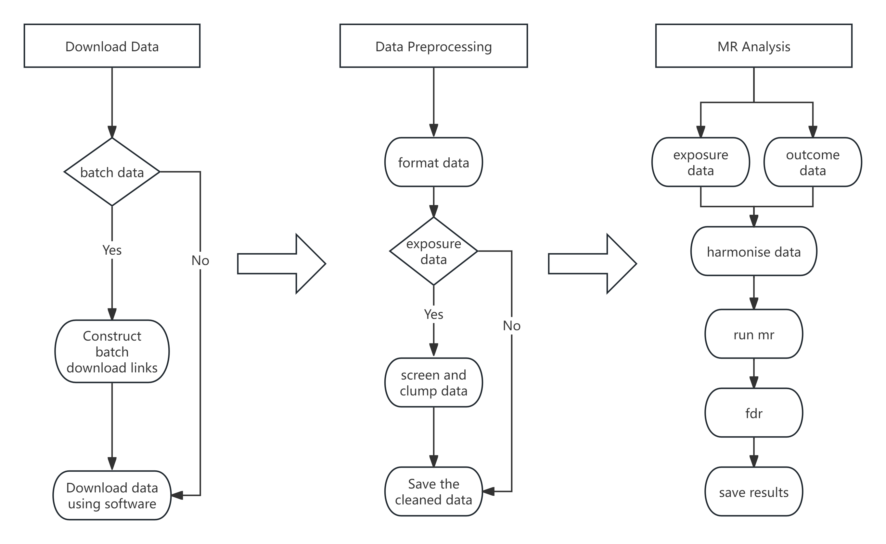
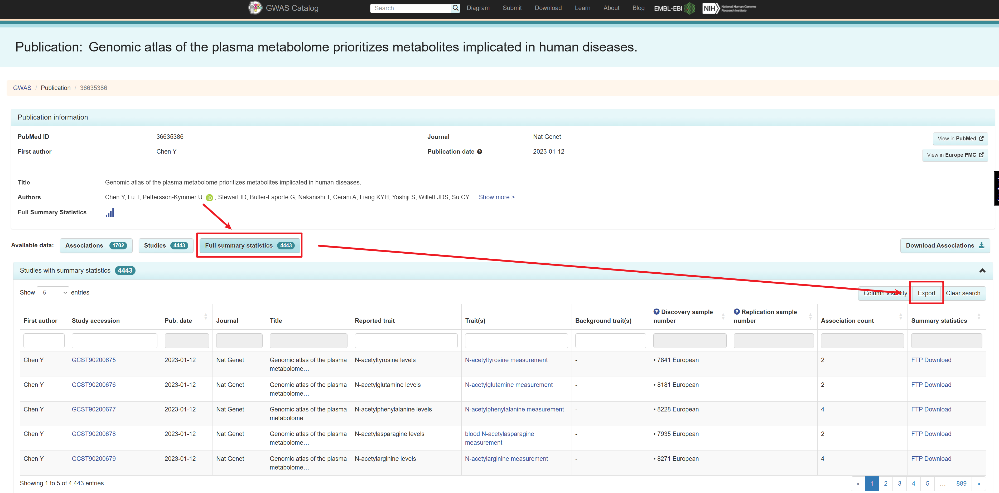
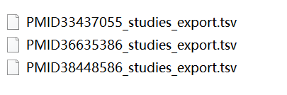
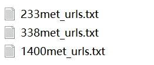
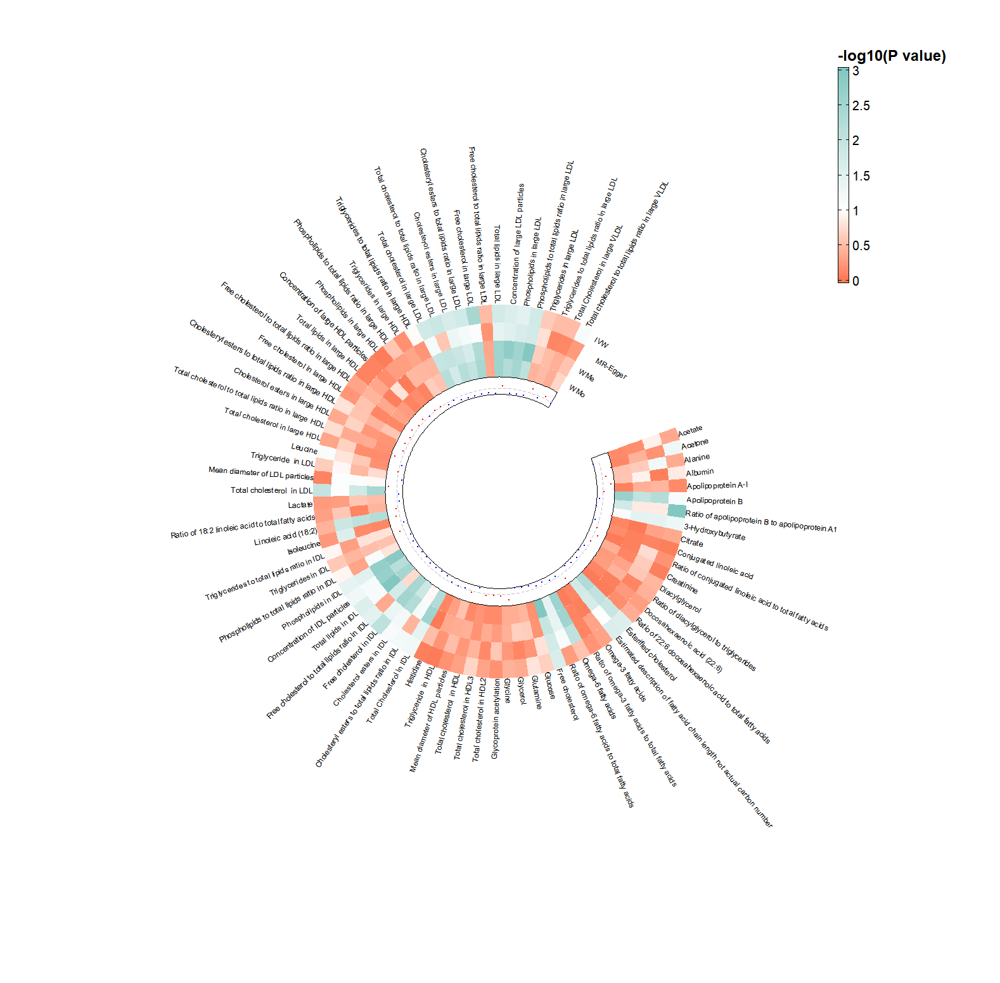

# MRflow
MRflow is a pipeline - based R project for Mendelian Randomization (MR). This project integrates a series of functions such as data downloading, data cleaning, and statistical analysis, which significantly enhances the efficiency of researchers in conducting Mendelian Randomization studies.


## 0.Prepare

**How to open the project?**
- You need to downlad R and RStudio in your machine. https://posit.co/download/rstudio-desktop/
- Download the project 
- Open the project with the file MRflow.Rproj

**R packages**
```R
install.packages(c("dplyr", "data.table", "remotes"))
remotes::install_github("MRCIEU/TwoSampleMR")
```
**Linkage Disequilibrium**

Download `LD.zip` and unzip it to the project path.

You can find additional resources from this link.
https://zenodo.org/records/14723456


## 1.Build URLs in batches and download the full summary data.
Construct links for batch downloading of summary data from the Catalog, and use code or tools to download the complete summary data. 

If your data comes from the Catalog, you can use the following steps to build batch download links.

### 1.Export target data details file
https://www.ebi.ac.uk/gwas/publications/36635386


### 2.Built according to download link rules

#### See the script for details.
- 101.build_url.R 
- 102.download_file.R
#### You can see examples of constructed download link files from the scripts and url_txt folders



## 2. Data Preprocessing

In this step, we will format the exposure and outcome data, perform p-value screening, and data clumping (clump_data) on the exposure data.

- **Read data**: Load the exposure and outcome data files.
- **Format data**: Ensure that the column names and formats of the exposure and outcome data are consistent for subsequent analysis.
- **Screen p-values**: Filter out SNPs with p-values less than a specific threshold (e.g., pval < 5e-8) to retain only significantly associated loci.
- **Clump data**: Perform data clumping on the exposure data to reduce linkage disequilibrium (LD) effects and ensure the selected SNPs are independent.

### Notes

- **P-value threshold for screening**: The p-value screening step is used to select SNPs that are statistically significantly associated. A common threshold is p-value < 5e-8, which is widely accepted to ensure the reliability of the results and reduce false positives.
- **Data clumping**: This step reduces the impact of linkage disequilibrium by selecting independent SNPs. Common methods, such as PLINK's clumping function, can be used to select SNPs based on physical distance and LD thresholds.


All data needs to be preprocessed into the following format.
| Column name     | Description                                                                 |
|-----------------|-----------------------------------------------------------------------------|
| **SNP**         | Single Nucleotide Polymorphism identifier, a unique ID for each genetic variant. |
| **effect_allele** | The allele for which the effect size (β) is reported. This is the allele associated with the trait. |
| **other_allele** | The alternative allele (non-effect allele) at the same SNP locus.          |
| **eaf**         | Effect allele frequency, representing the frequency of the effect allele in the population. |
| **beta**        | The estimated effect size of the effect allele on the trait (e.g., change in trait per allele). |
| **se**          | Standard error of the effect size estimate (β) , indicating the precision of the estimate. |
| **pval**        | p-value for the association between the SNP and the trait, indicating the statistical significance. |
| **samplesize**  | The number of samples used in the GWAS for this specific SNP.              |
| **chr**         | Chromosome number where the SNP is located.(Not necessary)                                |
| **pos**         | Physical position of the SNP on the chromosome (in base pairs).(Not necessary)            |

The following is a description of this part of the script.
| script name     | Description                                                                 |
|-----------------|-----------------------------------------------------------------------------|
|201.format_exposure.R | This script shows how to preprocess metabolite data from three sources.|
|202.format_outcome.R | This script describes how to preprocess PTSD outcome data.|
|201.format_exposure.R | This script describes how to preprocess data procedurally. You can learn how to process your own data from this script.|


**Once the data is formatted into the corresponding format, it can be directly analyzed using the MR analysis workflow in Step 3.**


## 3.MR Analysis (Core)
Run the mr analysis
- read exposure data
- read outcome data
- harmonise data
- run main mr analysis
- run sensitivity analysis(Heterogeneity Test and Pleiotropy test)
- calculate fdr of each mr method


# Metabolite MR analysis process

**Download to data/02format_data/ptsd**
- finngen_R11_F5_PTSD.gz
- PTSD.gz

**Download to data/04clump_data**
- 233met_all.gz
- 338met_all.gz
- 1400met_all.gz
- PTSD_clump.gz

**Run core script**
 open the file 301.core_mr_analysis.R

 source 301.core_mr_analysis.R to run all analyse.

**Once you have executed the code, you can get the results of the MR analysis from the results folder**

## 4.Plot
You can use any visualization package to display your results, such as:

1. **Forest Plot**: [GitHub - gforge/forestplot](https://github.com/gforge/forestplot)
2. **Circle Heat Map**: [GitHub - jokergoo/ComplexHeatmap](https://github.com/jokergoo/ComplexHeatmap)
3. **Interactive Complex Heatmap**: [GitHub - jokergoo/InteractiveComplexHeatmap](https://github.com/jokergoo/InteractiveComplexHeatmap)
4. **Chiplot**: [Chiplot Online](https://www.chiplot.online/)


The file 401.heatmap.R contains example code for creating a circle map.

The example data can be found in data/Table1.csv.




# Q&A
Can this project analyze any data?
- Yes.Once you format the data according to step 2, you can use this project to perform core mr analysis functions.
